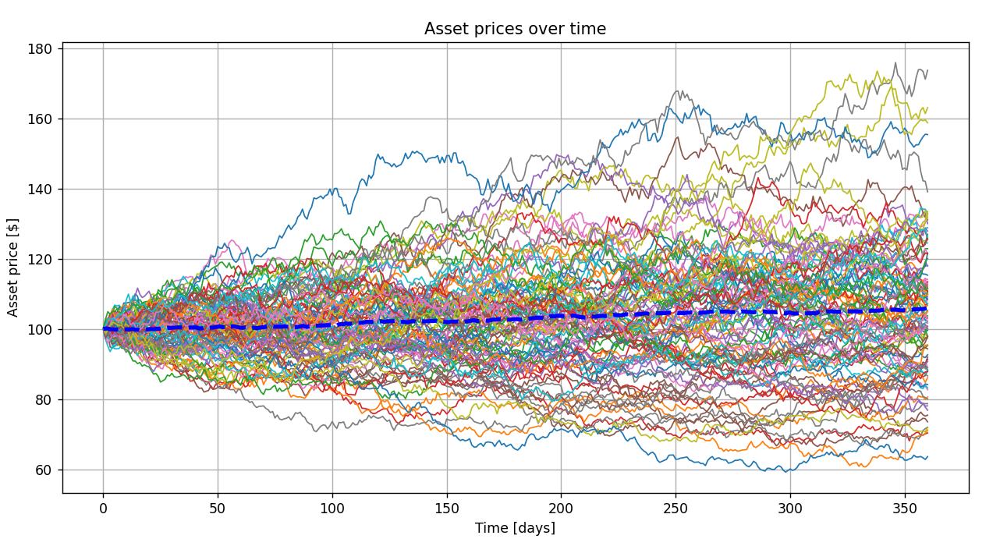

### BSM model
In the file _BSM_model.py_ I implemented a Black–Scholes–Merton model for options pricing.

### Monte Carlo
In the file _monte_carlo.py_ I implemented a Monte Carlo model for options pricing and created a simulation showing multiple paths of future asset prices. 

